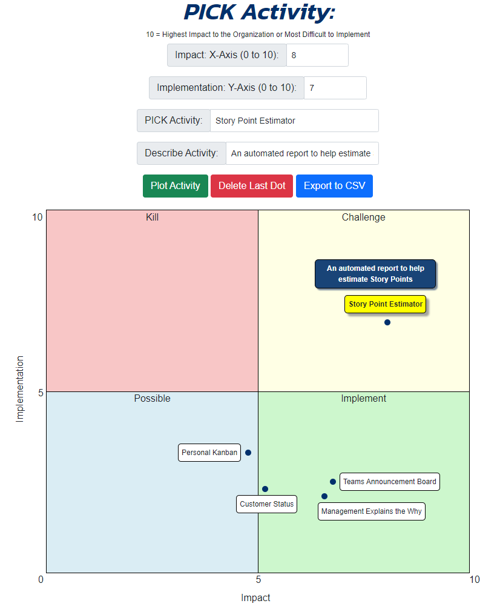

<h1 style="background-color: RGB(0,48,108); color: white; padding: 10px;">PICK App</h1>

##### Welcome to the PICK App - your ultimate tool for ideation and project management!

---

### Description:

`PICK` stands for `Possible`, `Implement`, `Challenge`, `Kill` - a strategic framework for evaluating and prioritizing project ideas. This app helps you visualize your ideas on a quadrant chart, making it easy to assess their feasibility and potential impact.

### Features:

1. **Quadrant Chart:** Easily plot your project ideas on a quadrant chart, with axes representing implementation difficulty and impact. This visual representation helps you understand where each idea stands in terms of viability and potential.

2. **Idea Management:** Organize your ideas within the app, keeping track of their progress, challenges, and potential implementation strategies.

3. **Collaboration:** Share your project ideas with team members, allowing for collaborative evaluation and brainstorming sessions. For example, I recently held a live session with my team where I asked each of them to perform their own PICK app assessments on our list of possible projects and had them send me their resulting CSV files. I then averages the scores to get a composite team PICK that we used to timephase the kickoff of our projects.

4. **Prioritization:** Use the PICK framework to prioritize your ideas effectively. Identify which projects are worth pursuing, which need further refinement, and which should be discarded altogether.

### Example Output:

